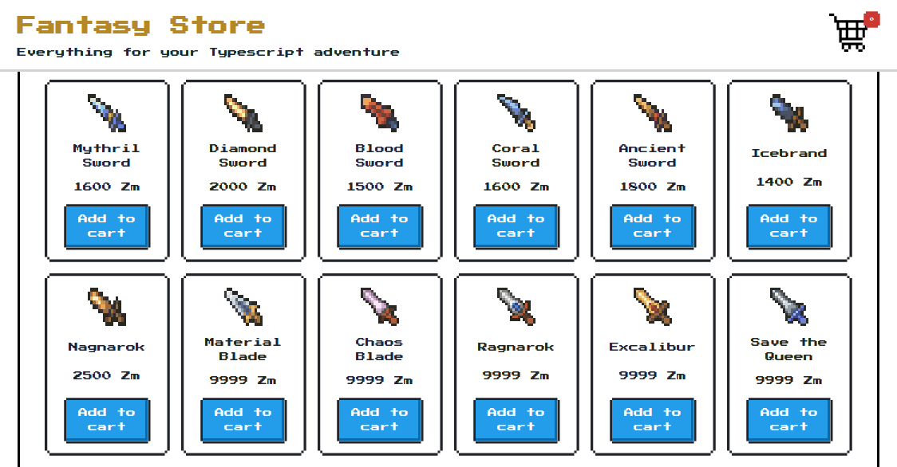
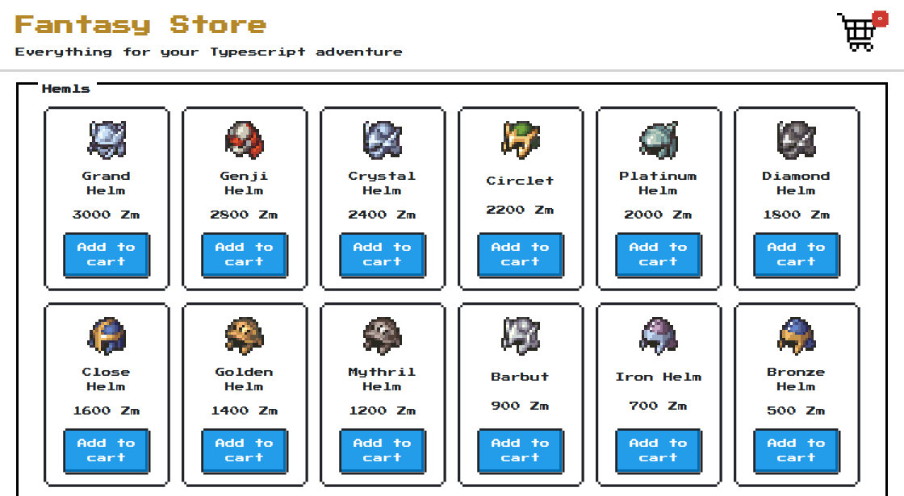
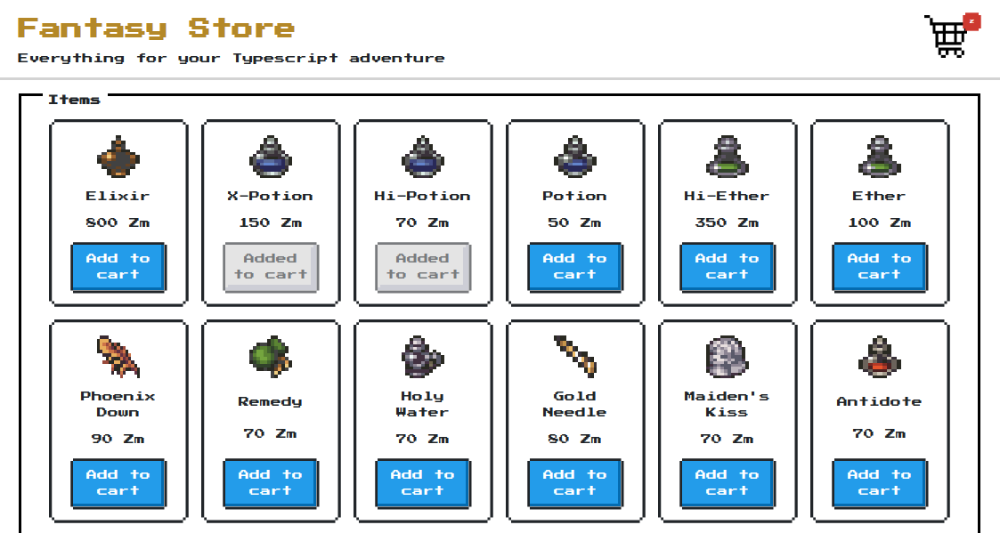
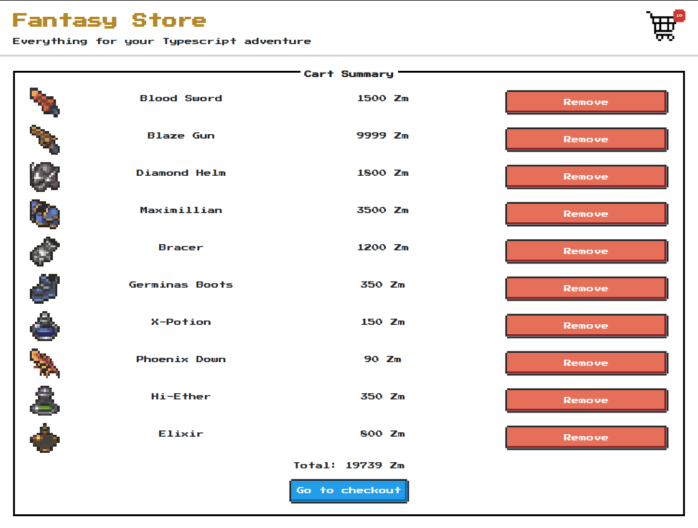
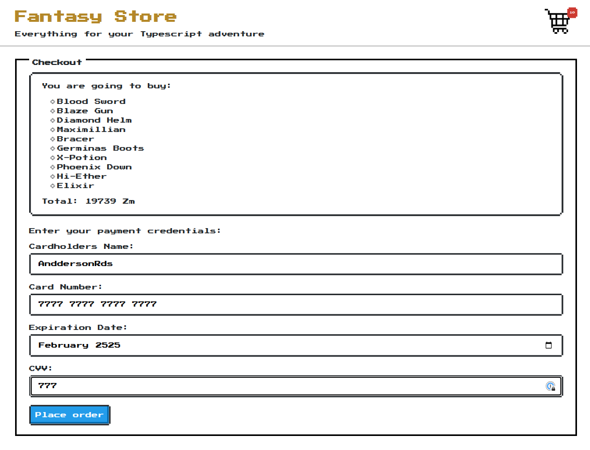
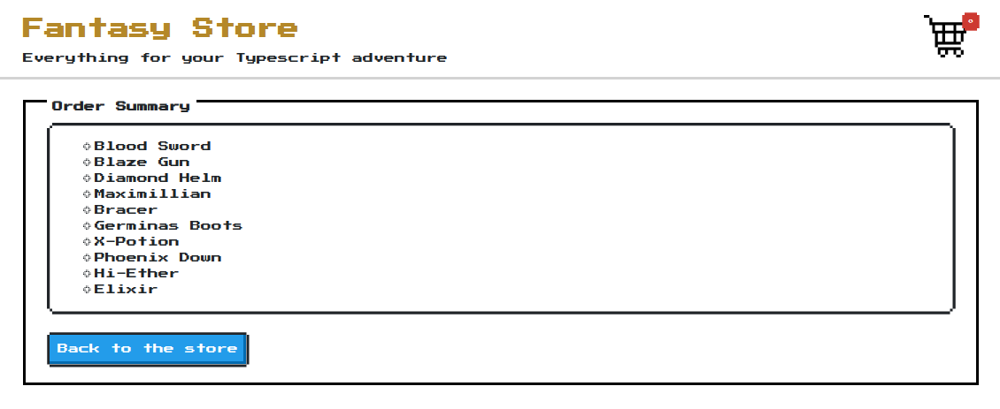

<p align="center">Fantasy Store</p>
<h4 align="center">Versão 1.0</h4>

<p align="center">
 <a href="#-sobre">Sobre</a> •
 <a href="#-layout">Layout</a> •
 <a href="#-executando-a-aplicação">Como executar</a> •
 <a href="#tecnologias">Tecnologias</a> •
 <a href="#como-contribuir">Como contribuir</a> •
 <a href="#-licença">Licença</a>
</p>

---

## 💡 Sobre

Projeto desenvolvido durante o estudo de tests usando `jest` e `testing-library`. Quem nunca desejou reviver a emoção de se equipar com grandes itens e marchar para as épicas batalhas da famosa Guerra dos Leões, não é mesmo? <br>

Nesse projeto simulamos uma loja de itena, possiblitando compra de espadas, escudos, armaduras e acessórios com a temática do clássico e maravilhoso game [Final Fantasy Tactics](http://dlgames.square-enix.com/fft/en/).<br>

---

## 🎨 Layout


### Web

<p align="center">
  
  
  
  
  
  
</p>

---

## 💻 Executando a aplicação

### Pré-requisitos

É necessário ter instalado na sua máquina para execução desse projeto:
- NodeJS
- Gerenciador de pacotes (Npm ou Yarn)

## 💻 Clonando o Repositório

```bash

$ git clone git@github.com:anddersonrds/fantasy-store.git

# entre na pasta do projeto

$ cd fantasy-store

```
### 💻 Rodando a aplicação

Instale as dependências

```bash

$ yarn

# ou, caso use npm

$ npm install

```

Rode a aplicação

```bash

$ yarn dev

# esse comando executa o server e a loja

# ou, caso use npm

$ npm dev

```

---

<h2 id="tecnologias"> 🛠️ Tecnologias </h2>

As ferramentas usadas no desenvolvimento do projeto.

#### SPA React:
- Typescript
- ReactJS
- React Router Dom
- Jest
- Testing Library
- Context Api
- Json Server

---

<h2 id="como-contribuir"> ⚙️ Como contribuir </h2>

- Faça um fork desse repositório;
- Crie uma branch com a sua feature: `git checkout -b minha-feature`;
- Faça commit das suas alterações: `git commit -m 'feat: Minha nova feature'`;
- Faça push para a sua branch: `git push origin minha-feature`.

---

## 📝 Licença

### Desenvolvido por [@anddersonrds](https://github.com/anddersonrds)
